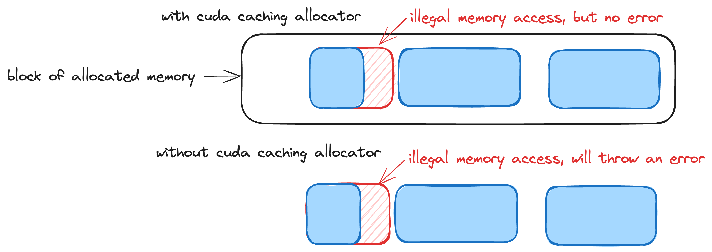

# AOTInductor Debugging Guide

If you encounter CUDA illegal memory access (IMA) errors while using [AOT Inductor](./torch.compiler_aot_inductor.md), this guide provides a systematic approach to debug such errors. AOT Inductor is part of the PT2 stack, similar to torch.compile, but it produces a compilation artifact that can work in a C++ environment. CUDA illegal memory errors can happen non-deterministically and even appear transient at times.

On a high-level, there are three main steps in debugging CUDA IMA errors:

- **Sanity checks**: Use basic debugging flags to catch common issues before diving deeper.
- **Pinpoint the CUDA IMA**: Make the error deterministic and identify the problematic kernel.
- **Identify problematic kernels**: Use intermediate value debugging to inspect kernel inputs and outputs.

## Step 1: Sanity Checks

Before diving deep into reliably reproducing the error, try out some existing debugging flags:

```bash
AOTI_RUNTIME_CHECK_INPUTS=1
TORCHINDUCTOR_NAN_ASSERTS=1
```

These flags take effect at compilation time (more precisely, at codegen time):

- `AOTI_RUNTIME_CHECK_INPUTS=1` checks if the inputs satisfy the same set of guards used during compilation. See {ref}`torch.compiler_troubleshooting` for more details.
- `TORCHINDUCTOR_NAN_ASSERTS=1` adds codegen before and after each Inductor's kernel to check for NaN.

## Step 2: Pinpoint the CUDA IMA

One hard part is CUDA IMA errors can be non-deterministic. They can happen at different locations, and sometimes not happen at all (though that just means the numerics are silently incorrect). With the following two flags, we can trigger the error deterministically:

```bash
PYTORCH_NO_CUDA_MEMORY_CACHING=1
CUDA_LAUNCH_BLOCKING=1
```

These flags take effect at runtime:

- `PYTORCH_NO_CUDA_MEMORY_CACHING=1` disables PyTorch's Caching Allocator, which allocates a bigger buffer than needed immediately to reduce the number of buffer allocations. This is usually the reason why CUDA illegal memory access errors are non-deterministic.


- `CUDA_LAUNCH_BLOCKING=1` forces the kernels to launch one at a time. Without this, we would get the famous "CUDA kernel errors might be asynchronously reported at some other API call" warning since kernels are launched asynchronously.

## Step 3: Identify Problematic Kernels with Intermediate Value Debugger

The AOTI Intermediate Value Debugger can help pinpoint the problematic kernel and get information about the inputs and outputs of said kernel.

First, use:

```bash
AOT_INDUCTOR_DEBUG_INTERMEDIATE_VALUE_PRINTER=3
```

This flag takes effect at compilation time and prints the kernels one by one at runtime. Together with the previous flags, this would let us know which kernel was launched right before the error happened.

However, it is important to note that just because the error happened in that kernel, it doesn't mean that kernel is problematic. For example, it can happen that an earlier kernel is problematic and produces some wrong outputs. So the natural next step is to inspect the inputs to the problematic kernel:

```bash
AOT_INDUCTOR_FILTERED_KERNELS_TO_PRINT="triton_poi_fused_add_ge_logical_and_logical_or_lt_231,_add_position_embeddings_kernel_5" AOT_INDUCTOR_DEBUG_INTERMEDIATE_VALUE_PRINTER=2
```

The filtered kernels to print environment variable has the names of the kernels you want to inspect. If the inputs to the kernel are not as expected, you then inspect the kernel that produces the bad input.

## Additional Debugging Tools

### Logging and Tracing

- **tlparse / TORCH_TRACE**: Provides complete output codes for inspection and records the set of guards used. See {ref}`tlparse / TORCH_TRACE <tlparse-torch-trace>` for more details.
- **TORCH_LOGS**: Use `TORCH_LOGS="+inductor,output_code"` to see more PT2 internal logs. See {ref}`TORCH_LOGS <torch-logs>` for more details.
- **TORCH_SHOW_CPP_STACKTRACES**: Set `TORCH_SHOW_CPP_STACKTRACES=1` to potentially see more stack traces.

### Common Sources of Issues

- [**Dynamic shapes**](./torch.compiler_dynamic_shapes.md): Historically a source of many IMAs. Pay special attention when debugging dynamic shape scenarios.
- **Custom ops**: Especially when implemented in C++ and used with dynamic shapes. There is a need to Symint'ify the meta function.
